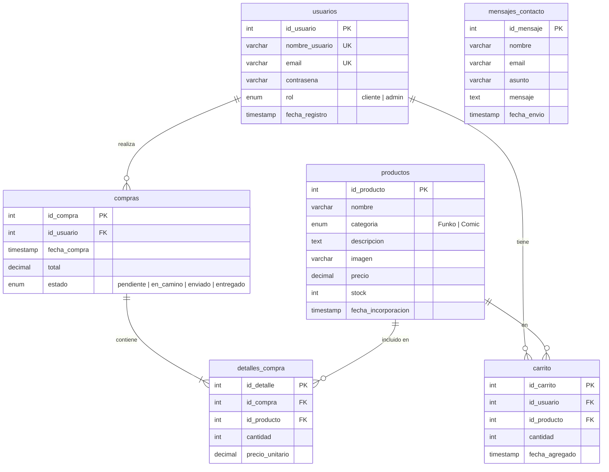

<div align="center">

<!-- Banner principal -->


# 🍜 OtakuStore

### Tu tienda online de confianza para manga y anime

[](https://www.php.net/)
[](https://mariadb.org/)
[](https://www.docker.com/)
[](#-licencia)

<br>


---

**OtakuStore** es una tienda online completa de productos otaku (Funko Pops y Mangas) desarrollada con **PHP nativo**, **MySQL** y **JavaScript vanilla**. Incluye panel de administración, carrito de compras, gestión de pedidos y diseño responsive.

[🌐 Ver Demo](https://otakustore.es) · [📋 Documentación](#-estructura-del-proyecto) · [🚀 Instalación](#-instalación)

</div>

---

## 📑 Índice

- [✨ Características](#-características)
- [🛠️ Tecnologías](#️-tecnologías)
- [📁 Estructura del Proyecto](#-estructura-del-proyecto)
- [🗄️ Base de Datos](#️-base-de-datos)
- [🚀 Instalación](#-instalación)
- [🐳 Docker](#-docker)
- [📄 Páginas Públicas](#-páginas-públicas)
- [🔒 Panel de Administración](#-panel-de-administración)
- [🛒 API del Carrito](#-api-del-carrito)
- [🎨 Sistema de Estilos](#-sistema-de-estilos)
- [⚙️ JavaScript](#️-javascript)
- [📜 Páginas Legales](#-páginas-legales)
- [👤 Autor](#-autor)
- [📝 Licencia](#-licencia)

---

## ✨ Características

<table>
<tr>
<td width="50%">

### 🛍️ Tienda Pública
- 🎯 Catálogo de **Funko Pops** y **Mangas**
- 🔍 Búsqueda por nombre con filtros por categoría
- 📄 Paginación configurable (6, 10 o 12 por página)
- 🛒 Carrito de compras con AJAX (sin recargar)
- 📦 Seguimiento de pedidos con barra de progreso
- 📱 Diseño **100% responsive** (móvil, tablet, escritorio)
- 🎠 Carrusel animado en la página de inicio
- 👁️ Contador de visitas con cookies

</td>
<td width="50%">

### 🔐 Panel Admin
- 📊 Dashboard con accesos rápidos
- 📦 CRUD completo de productos (con subida de imagen)
- 👥 Gestión de usuarios (editar rol, eliminar)
- 🚚 Gestión de pedidos (cambiar estado)
- 📄 Exportación de productos a **PDF** (FPDF)
- ✅ Validación de formularios (cliente + servidor)
- 🛡️ Protección por rol de usuario

</td>
</tr>
</table>

### 🌟 Extras
| Función | Detalle |
|---|---|
| 🔐 Autenticación | Login/Registro con `password_hash` y `password_verify` |
| 🎪 Ferias | Calendario de convenciones anime en España 2026 |
| 📬 Contacto | Formulario que guarda mensajes en la base de datos |
| ⚖️ Legal | Aviso legal, política de cookies y de privacidad |
| 🎨 Animaciones | Carrusel CSS, scroll-to-top con jQuery, micro-animaciones hover |
| 🐳 Docker | Dockerfile + docker-compose listos para desplegar |

---

## 🛠️ Tecnologías

<div align="center">

| Capa | Tecnología |
|:---:|:---|
| **Backend** | PHP 8.2 nativo (sin frameworks) |
| **Base de datos** | MariaDB 10.4 / MySQL con PDO |
| **Frontend** | HTML5 semántico + CSS3 vanilla + JavaScript ES6 |
| **Tipografía** | Nunito (fuente local) |
| **Iconos** | Font Awesome 7.0 |
| **Librería JS** | jQuery 3.7.1 |
| **Carrusel** | Fancyapps Carousel v6.1 |
| **PDF** | FPDF (PHP) |
| **Contenedores** | Docker + Docker Compose |
| **Hosting** | Hostinger |

</div>

---

## 📁 Estructura del Proyecto

```
OtakuStore/
│
├── 📄 index.php                 # Página de inicio (carrusel + más vendidos)
├── 📄 tienda.php                # Catálogo con filtros, búsqueda y paginación
├── 📄 producto.php              # Detalle de producto individual
├── 📄 carrito.php               # Página del carrito de compras
├── 📄 pedidos.php               # Historial de pedidos del usuario
├── 📄 login.php                 # Inicio de sesión
├── 📄 registro.php              # Registro de nuevos usuarios
├── 📄 contacto.php              # Formulario de contacto
├── 📄 ferias.php                # Calendario de ferias anime
├── 📄 logout.php                # Cierre de sesión
│
├── 🐳 Dockerfile                # Imagen PHP 8.2 + Apache
├── 🐳 docker-compose.yml        # Orquestación web + base de datos
│
├── 📂 admin/                    # Panel de administración
│   ├── index.php                # Dashboard principal
│   ├── productos.php            # Listado de productos (admin)
│   ├── nuevo_producto.php       # Formulario para añadir producto
│   ├── editar_producto.php      # Formulario para editar producto
│   ├── borrar_producto.php      # Eliminar producto
│   ├── usuarios.php             # Listado de usuarios
│   ├── editar_usuario.php       # Editar usuario (rol, datos)
│   ├── borrar_usuario.php       # Eliminar usuario
│   ├── pedidos.php              # Listado de pedidos (admin)
│   ├── ver_pedido.php           # Detalle de pedido
│   ├── actualizar_pedido.php    # Cambiar estado del pedido
│   └── exportar_productos_pdf.php # Exportar catálogo a PDF
│
├── 📂 includes/                 # Componentes reutilizables
│   ├── header.php               # Cabecera pública (nav + CSS dinámico)
│   ├── header_admin.php         # Cabecera del panel admin
│   ├── footer.php               # Pie de página con redes y legal
│   ├── conexion.php             # Conexión PDO a MySQL (⚠️ en .gitignore)
│   ├── funciones.php            # Funciones del carrito y pedidos
│   ├── carrito_api.php          # API REST para operaciones del carrito
│   └── otakustore.sql           # Script de creación de la base de datos
│
├── 📂 config/
│   └── parametros.php           # BASE_URL dinámica y BASE_PATH
│
├── 📂 assets/
│   ├── 📂 css/                  # Hojas de estilo (17 archivos)
│   │   ├── estilos.css          # Estilos globales (header, footer, reset)
│   │   ├── inicio.css           # Página de inicio
│   │   ├── tienda.css           # Catálogo de productos
│   │   ├── producto.css         # Detalle de producto
│   │   ├── carrito.css          # Carrito de compras
│   │   ├── pedidos.css          # Mis pedidos
│   │   ├── login.css            # Login y registro
│   │   ├── contacto.css         # Formulario de contacto
│   │   ├── ferias.css           # Página de ferias
│   │   ├── legal.css            # Páginas legales
│   │   └── admin_*.css          # Estilos del panel admin (7 archivos)
│   │
│   ├── 📂 js/                   # Scripts JavaScript (11 archivos)
│   │   ├── menu.js              # Menú hamburguesa responsive
│   │   ├── carrito.js           # Añadir al carrito (AJAX)
│   │   ├── carrito_page.js      # Gestión del carrito (cantidades, compra)
│   │   ├── tienda.js            # Filtros y cookies de productos/página
│   │   ├── efectos.js           # Scroll-to-top + animaciones
│   │   ├── validacion.js        # Validación login/registro
│   │   ├── fecha_pedidos.js     # Fechas relativas en pedidos
│   │   └── admin_*.js           # Scripts del panel admin (4 archivos)
│   │
│   ├── 📂 img/                  # Imágenes del proyecto
│   └── 📂 fonts/                # Fuente Nunito (local)
│
├── 📂 legal/                    # Páginas legales (HTML estático)
│   ├── aviso_legal.html
│   ├── politica_cookies.html
│   └── politica_privacidad.html
│
└── 📂 lib/                      # Librería FPDF para generar PDFs
    └── fpdf.php
```

---

## 🗄️ Base de Datos

La base de datos `otakustore` utiliza **MariaDB/MySQL** con las siguientes tablas:



### 📊 Resumen de Tablas

| Tabla | Descripción | Relaciones |
|---|---|---|
| `usuarios` | Clientes y administradores | → compras, carrito |
| `productos` | Catálogo (Funkos y Mangas) | → carrito, detalles_compra |
| `carrito` | Productos pendientes de compra | usuario + producto (UNIQUE) |
| `compras` | Pedidos realizados | → detalles_compra |
| `detalles_compra` | Líneas de cada pedido | compra + producto |
| `mensajes_contacto` | Mensajes del formulario de contacto | Sin relaciones |

> **Nota:** Todas las foreign keys usan `ON DELETE CASCADE ON UPDATE CASCADE` para mantener la integridad referencial.

---

## 🚀 Instalación

### Requisitos Previos

- **PHP** 8.2+ con extensiones `pdo`, `pdo_mysql`, `mbstring`
- **MySQL** 5.7+ / MariaDB 10.4+
- **Apache** con `mod_rewrite` habilitado (o XAMPP)
- **Git**

### Instalación Local (XAMPP)

```bash
# 1. Clonar el repositorio en htdocs
cd C:\xampp\htdocs
git clone https://github.com/RotaruX/OtakuStore.git

# 2. Importar la base de datos
#    Abrir phpMyAdmin → Importar → seleccionar:
#    includes/otakustore.sql

# 3. Configurar la conexión a la base de datos
#    Crear el archivo includes/conexion.php:
```

```php
<?php
require_once(__DIR__ . '/../config/parametros.php');

$db_host = 'localhost';
$db_name = 'otakustore';
$db_user = 'root';        // tu usuario de MySQL
$db_pass = '';             // tu contraseña de MySQL

try {
    $conexion = new PDO(
        "mysql:host={$db_host};dbname={$db_name};charset=utf8mb4",
        $db_user,
        $db_pass,
        [
            PDO::ATTR_ERRMODE            => PDO::ERRMODE_EXCEPTION,
            PDO::ATTR_DEFAULT_FETCH_MODE => PDO::FETCH_ASSOC,
            PDO::ATTR_EMULATE_PREPARES   => false
        ]
    );
} catch (PDOException $e) {
    die("Error de conexión: " . $e->getMessage());
}
```

```bash
# 4. Iniciar Apache y MySQL en XAMPP

# 5. Acceder a la tienda
#    http://localhost/OtakuStore/
```

> ⚠️ **Importante:** El archivo `includes/conexion.php` está en `.gitignore` por seguridad. Debes crearlo manualmente con tus credenciales.

---

## 🐳 Docker

El proyecto incluye soporte completo para Docker:

### Dockerfile
- Imagen base: `php:8.2-apache`
- Extensiones: `pdo`, `pdo_mysql`, `mbstring`
- Módulo Apache: `mod_rewrite`
- Permisos de escritura en `assets/img/`

### Docker Compose

```bash
# Levantar la aplicación completa
docker-compose up -d

# La app estará disponible en:
# http://localhost:8080
```

**Servicios:**

| Servicio | Imagen | Puerto |
|---|---|---|
| `web` | PHP 8.2 + Apache | `8080:80` |
| `db` | MariaDB 10.11 | `3307:3306` |

**Variables de entorno:**

| Variable | Valor |
|---|---|
| `DB_HOST` | `db` |
| `DB_NAME` | `otakustore` |
| `DB_USER` | `otakustore_user` |
| `DB_PASS` | `otakustore_pass` |

> La base de datos se inicializa automáticamente con `includes/otakustore.sql`.

---

## 📄 Páginas Públicas

### 🏠 Inicio (`index.php`)
- Carrusel animado con CSS `@keyframes` (5 imágenes de fondo)
- Contador de visitas con cookies (persistente 1 año)
- Sección "Más Vendidos" con 4 productos destacados
- Sección de categorías (Funkos / Mangas) con efecto hover
- Banner de Ferias con enlace

### 🏪 Tienda (`tienda.php`)
- Catálogo paginado con grid responsive
- Filtros por categoría: Todos / Funkos / Mangas
- Buscador por nombre de producto
- Productos por página configurables via cookie
- Badges de categoría en cada tarjeta
- Botón "Añadir al carrito" con AJAX
- Control de stock (botón deshabilitado si no hay)

### 📦 Detalle de Producto (`producto.php`)
- Imagen del producto con badge de categoría
- Precio, stock disponible y descripción completa
- Breadcrumb de navegación (Tienda → Producto)
- Botón "Añadir al carrito" con confirmación visual
- Banner de confirmación animado

### 🛒 Carrito (`carrito.php`)
- Requiere autenticación (redirige a login si no)
- Lista de productos con imagen, nombre, precio unitario
- Control de cantidad (+/-) con verificación de stock
- Checkboxes para seleccionar productos
- Opciones: "Comprar seleccionados" / "Comprar todo"
- Eliminación individual de productos
- Total dinámico actualizado en tiempo real

### 📋 Mis Pedidos (`pedidos.php`)
- Historial de compras del usuario autenticado
- Barra de progreso visual del estado: `Pendiente → En camino → Enviado → Entregado`
- Detalle de productos comprados con subtotales
- Fechas relativas generadas con JavaScript

### 🎪 Ferias (`ferias.php`)
- Calendario de convenciones anime en España 2026
- Cards con ubicación, dirección, fecha y descripción
- Galería con carrusel Fancyapps (autoplay + lazy loading)
- 6 eventos: Manga Barcelona, Salón del Manga Madrid, Japan Weekend, Expomanga, HeroFest Bilbao

### 📬 Contacto (`contacto.php`)
- Formulario con campos: nombre, email, asunto, mensaje
- Validación servidor (campos vacíos, email válido)
- Los mensajes se almacenan en `mensajes_contacto`
- Mensaje de éxito/error visual

### 🔑 Login y Registro
- **Login** (`login.php`): Autenticación por usuario o email
- **Registro** (`registro.php`): Con validación de contraseña (mín. 6 caracteres, confirmación)
- Contraseñas hasheadas con `password_hash(PASSWORD_DEFAULT)`
- Redirección automática según rol (admin → panel, cliente → inicio)
- Validación JavaScript en el cliente

---

## 🔒 Panel de Administración

> Accesible solo para usuarios con rol `admin`. Se accede desde el icono 🛡️ en el header.

### 📊 Dashboard (`admin/index.php`)
- Tarjetas con acceso rápido a cada sección
- Iconos descriptivos con lista de acciones disponibles

### 📦 Gestión de Productos
| Página | Acción |
|---|---|
| `productos.php` | Listado con búsqueda, tabla y acciones |
| `nuevo_producto.php` | Formulario para crear producto (con subida de imagen) |
| `editar_producto.php` | Editar nombre, precio, stock, categoría, imagen |
| `borrar_producto.php` | Eliminar producto con confirmación |
| `exportar_productos_pdf.php` | Generar PDF del catálogo con FPDF |

### 👥 Gestión de Usuarios
| Página | Acción |
|---|---|
| `usuarios.php` | Listado de usuarios registrados |
| `editar_usuario.php` | Cambiar rol (cliente/admin), editar datos |
| `borrar_usuario.php` | Eliminar cuenta de usuario |

### 🚚 Gestión de Pedidos
| Página | Acción |
|---|---|
| `pedidos.php` | Listado de todos los pedidos |
| `ver_pedido.php` | Detalle completo del pedido |
| `actualizar_pedido.php` | Cambiar estado (pendiente → en camino → enviado → entregado) |

---

## 🛒 API del Carrito

El archivo `includes/carrito_api.php` expone una API REST para gestionar el carrito vía AJAX:

```
POST /includes/carrito_api.php
Content-Type: application/x-www-form-urlencoded
```

| Acción | Parámetros | Respuesta |
|---|---|---|
| `añadir` | `id_producto` | `{"ok": true}` |
| `eliminar` | `id_producto` | `{"ok": true}` |
| `actualizar` | `id_producto`, `cantidad` | `{"ok": true, "cantidad": N}` |
| `comprar` | `ids_productos` (CSV) | `{"ok": true, "id_pedido": N}` |

**Respuestas de error:**
```json
{"logueado": false}          // Usuario no autenticado
{"error": "Producto no válido"}
{"ok": false, "mensaje": "Sin stock disponible"}
{"ok": false, "mensaje": "Stock insuficiente (disponible: N)"}
```

> **Seguridad:** Requiere sesión activa. Todas las consultas usan **prepared statements** (PDO) para prevenir SQL injection.

---

## 🎨 Sistema de Estilos

### Paleta de Colores

| Color | Hex | Uso |
|:---:|:---:|---|
| 🟡 | `#FFD447` | Color primario (header, footer, botones) |
| 🟠 | `#E6B93C` | Hover del color primario |
| ⬛ | `#212529` | Texto principal |
| ⬜ | `#FFFFFF` | Fondos de tarjetas |
| 🟢 | `#27ae60` | Confirmación (añadido al carrito) |
| 🔴 | `#e74c3c` | Errores y alertas |
| 🩶 | `#999` | Texto secundario |

### Tipografía
- **Fuente principal:** Nunito (variable weight 200-1000, cargada localmente)
- **Formato:** `@font-face` con archivo `.ttf`

### Enfoque Responsive
El CSS sigue un enfoque **mobile-first** con 3 breakpoints:

```css
/* Vista móvil (default) */
/* Vista tablet */   @media (min-width: 768px)  { ... }
/* Vista escritorio */ @media (min-width: 1024px) { ... }
```

### Archivos CSS

| Archivo | Alcance |
|---|---|
| `estilos.css` | Global: reset, header, footer, scroll-to-top |
| `inicio.css` | Carrusel, tarjetas, secciones de inicio |
| `tienda.css` | Grid de productos, filtros, paginación |
| `producto.css` | Detalle de producto, breadcrumb |
| `carrito.css` | Tarjetas del carrito, resumen |
| `pedidos.css` | Cards de pedidos, barra de progreso |
| `login.css` | Formularios de login y registro |
| `contacto.css` | Hero de contacto, formulario |
| `ferias.css` | Cards de ferias, galería |
| `legal.css` | Páginas legales |
| `admin_*.css` | 7 archivos para el panel de administración |

---

## ⚙️ JavaScript

| Archivo | Función |
|---|---|
| `menu.js` | Toggle del menú hamburguesa en móvil |
| `carrito.js` | Añadir al carrito desde tienda/inicio (AJAX + `fetch`) |
| `carrito_page.js` | Gestión completa del carrito: cantidades, eliminar, comprar, checkboxes, totales dinámicos |
| `tienda.js` | Filtro de productos/página con cookies, botones de añadir en grid |
| `efectos.js` | Botón scroll-to-top con jQuery, animaciones de entrada |
| `validacion.js` | Validación de formularios login/registro en el cliente |
| `fecha_pedidos.js` | Convierte fechas ISO a formato relativo ("hace 2 días") |
| `admin_productos.js` | Confirmación de eliminación de productos |
| `admin_usuarios.js` | Confirmación de eliminación de usuarios |
| `admin_pedidos.js` | Interactividad en la tabla de pedidos |
| `admin_validacion.js` | Validación de formularios del admin (producto, usuario) |

---

## 📜 Páginas Legales

El directorio `legal/` contiene páginas HTML estáticas con:

- **Aviso Legal** — Datos del titular, objeto del sitio y legislación aplicable
- **Política de Cookies** — Tipos de cookies, finalidad y gestión
- **Política de Privacidad** — Tratamiento de datos, derechos ARCO-POL

> Accesibles desde el footer de todas las páginas.

---

## 🔐 Seguridad

| Medida | Implementación |
|---|---|
| Contraseñas | Hasheadas con `password_hash()` / `password_verify()` (bcrypt) |
| SQL Injection | Prepared statements con PDO en todas las consultas |
| XSS | `htmlspecialchars()` en todas las salidas |
| Sesiones | Control de rol en cada página admin |
| Credenciales | `conexion.php` excluido del repositorio vía `.gitignore` |
| CSRF | Validación de método HTTP en la API |

---

## 👤 Autor

<div align="center">

**Alexandru Rotaru** · *RotaruX*

[](https://github.com/RotaruX)

*Hecho con 🍜 y mucho anime*

</div>

---

## 📝 Licencia

Este proyecto ha sido desarrollado con fines educativos. Todo el código es original y puede ser usado como referencia o inspiración para proyectos similares.

---

<div align="center">


**© 2026 OtakuStore** — Tu tienda otaku de confianza

</div>
